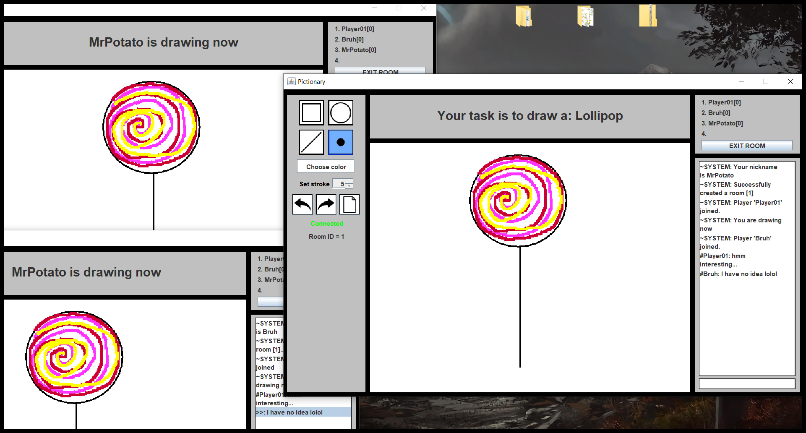

# PictionaryApp
Desktop server-client app which utilizes Pictionary game rules, made just for learning purposes.\
I explicitly wanted not to use any java ObjectStreams for object serialization and get familiar with Google gson library

## Built With

* [Maven](https://maven.apache.org/) - Dependency Management
* [Gson](https://github.com/google/gson) - Json serialization tool
* [Project Lombok](https://projectlombok.org/) - Used to reduce boilerplate code
